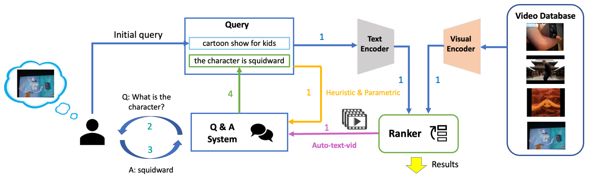

<div align="center">

<h2>【ICCV'2023】Simple Baselines for Interactive Video Retrieval with Questions and Answers </h2>
        
</div>

Official code for the ICCV'23 paper ["Simple Baselines for Interactive Video Retrieval with Questions and Answers"](https://arxiv.org/abs/2308.10402).

Authors: [Kaiqu Liang](), and [Samuel Albanie](http://samuelalbanie.com/).

## Introduction
To date, the majority of video retrieval systems have been optimized for a "single-shot" scenario in which the user submits a query in isolation, ignoring previous interactions with the system. Recently, there has been renewed interest in interactive systems to enhance retrieval, but existing approaches are complex and deliver limited gains in performance. In this work, we revisit this topic and propose several simple yet effective baselines for interactive video retrieval via question-answering. We employ a VideoQA model to simulate user interactions and show that this enables the productive study of the interactive retrieval task without access to ground truth dialogue data. Experiments on MSR-VTT, MSVD, and AVSD show that our framework using question-based interaction significantly improves the performance of text-based video retrieval systems.


## Setup

1. Set up the environment
```bash
git clone https://github.com/kevinliang888/IVR-QA-baselines
cd IVR-QA-baselines
pip install -r requirements.txt
```

2. Download raw videos of downstream datasets into `datasets` directory.

## Running
### MSRVTT
* Heuristic
```
python -m torch.distributed.run --nproc_per_node=1 eval_interactive.py \
--retrieval_config './configs/retrieval_msrvtt.yaml' --output_dir 'output/Retrieval_msrvtt' \
--augment --separate --num_segment 2 --ask_object --ask_regular
```
* Auto-text
```
python -m torch.distributed.run --nproc_per_node=1 eval_interactive.py \
--retrieval_config './configs/retrieval_msrvtt.yaml' --output_dir 'output/Retrieval_msrvtt' \
--automatic --augment --round 1
```
* Auto-text-vid
```
python -m torch.distributed.run --nproc_per_node=1 eval_interactive.py \
--retrieval_config './configs/retrieval_msrvtt.yaml' --output_dir 'output/Retrieval_msrvtt' \
--automatic --augment --round 1 --use_caption
```  
For other datasets (e.g., MSVD, AVSD, LSMDC, Didemo, Activity Net):

1. Modify the `--retrieval_config` argument to point to the appropriate `retrieval_{DATASET_NAME}.yaml` file in the `configs` directory.
2. Adjust the `--output_dir` argument to specify the desired output directory for that dataset.
3. Adjust the `--round` argument for different number of interactions.

## Citation
If you find this code to be useful for your research, please consider citing.
<pre>
@inproceedings{liang2023simple,
  title={Simple Baselines for Interactive Video Retrieval with Questions and Answers},
  author={Liang, Kaiqu and Albanie, Samuel},
  booktitle={Proceedings of the IEEE/CVF International Conference on Computer Vision},
  pages={11091--11101},
  year={2023}
}</pre>


## Acknowledgements
Some of the codes are built upon [BLIP](https://github.com/salesforce/BLIP). We thank the original authors for their open-sourcing.